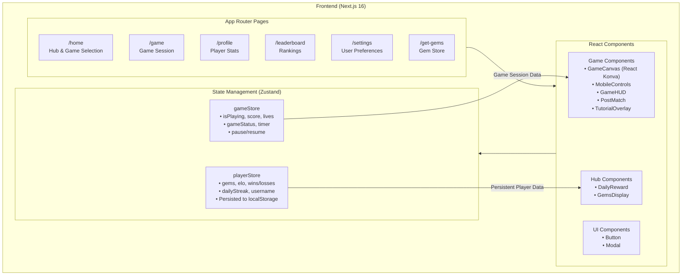
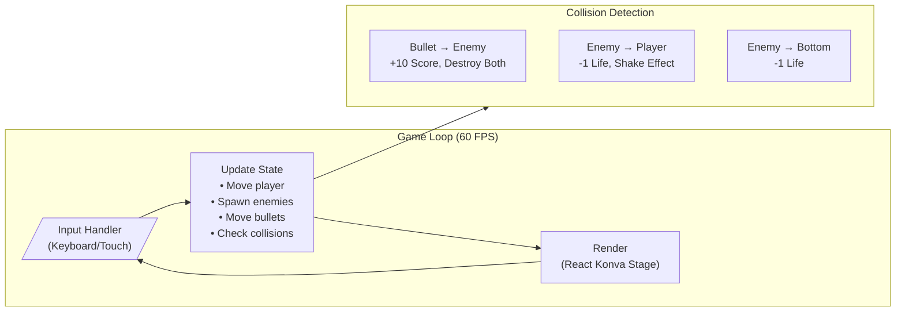
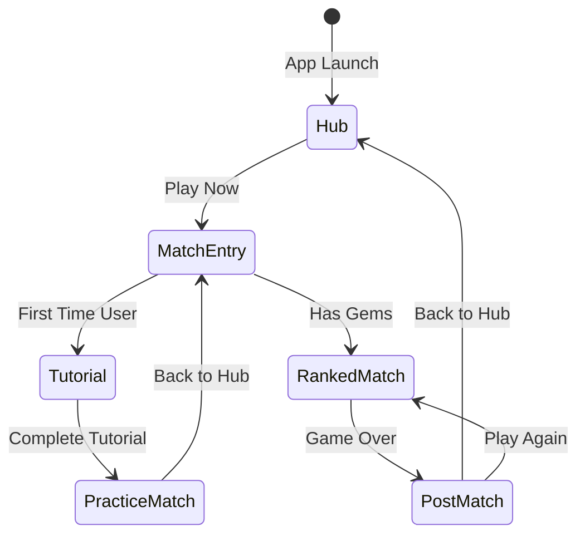

# Titan Arcade 🚀

A fast-paced mobile arcade game hub built with Next.js 16, featuring a Space Shooter game with ELO-based matchmaking, daily rewards, and a gem-based economy.


---

## 📖 Overview

Titan Arcade is a **mobile-first arcade game hub** designed for quick, intuitive, and motivating user experiences. The MVP includes:

- **Space Shooter**: A touch/keyboard-controlled arcade game with enemies, bullets, and scoring
- **ELO-Based Matchmaking**: Players compete in ranked matches with stake-based gem betting
- **Daily Rewards System**: Streak-based rewards to encourage daily engagement
- **Player Profiles**: Stats tracking including wins, losses, best scores, and ELO rating
- **Gem Economy**: In-game currency for match entry and rewards

---

## 🏗️ Project Architecture



---

## 📁 Directory Structure

```
titan-arcade/
├── app/                          # Next.js App Router
│   ├── page.tsx                  # Home hub (game selection, daily rewards)
│   ├── game/page.tsx             # Game session page
│   ├── profile/page.tsx          # Player profile & stats
│   ├── leaderboard/page.tsx      # ELO rankings
│   ├── settings/page.tsx         # User settings
│   ├── get-gems/page.tsx         # Gem store (mocked IAP)
│   ├── layout.tsx                # Root layout
│   └── globals.css               # Global styles & TailwindCSS
├── components/
│   ├── game/                     # Game-specific components
│   │   ├── GameCanvas.tsx        # Main game canvas (React Konva)
│   │   ├── MobileControls.tsx    # Touch controls for mobile
│   │   ├── GameHUD.tsx           # Score, lives, timer display
│   │   ├── PostMatch.tsx         # Post-game results screen
│   │   ├── TutorialOverlay.tsx   # First-time user tutorial
│   │   ├── MatchEntry.tsx        # Match type selection & entry
│   │   └── ControlsOverlay.tsx   # Control hints overlay
│   ├── hub/                      # Hub/home components
│   │   ├── DailyReward.tsx       # Daily streak rewards
│   │   └── GemsDisplay.tsx       # Gem balance display
│   ├── match/                    # Matchmaking components
│   └── ui/                       # Reusable UI components
│       ├── Button.tsx            # Styled button component
│       └── Modal.tsx             # Modal dialog component
├── store/                        # Zustand state stores
│   ├── gameStore.ts              # Game session state
│   └── playerStore.ts            # Persistent player data
├── lib/                          # Utility functions
│   ├── matchmaking.ts            # ELO & matchmaking logic
│   ├── mockData.ts               # Mock data for development
│   ├── storage.ts                # Local storage utilities
│   └── utils.ts                  # General utilities
└── public/                       # Static assets
    ├── spaceship_sprite.png      # Player ship sprite
    ├── enemy_1.png               # Enemy variant 1
    ├── enemy_2.png               # Enemy variant 2
    └── enemy_3.png               # Enemy variant 3
```

---

## ⚡ Technical Stack

| Category | Technology | Purpose |
|----------|------------|---------|
| **Framework** | Next.js 16 | App Router, Server Components, SSR |
| **Language** | TypeScript 5 | Type safety, better DX |
| **Styling** | TailwindCSS 4 | Utility-first CSS, dark theme |
| **State** | Zustand | Lightweight state management |
| **Persistence** | zustand/persist | LocalStorage sync |
| **Game Engine** | React Konva | HTML5 Canvas rendering |
| **Animations** | Framer Motion | Smooth UI transitions |
| **Icons** | Lucide React | Consistent iconography |
| **Data Fetching** | TanStack Query | (Ready for API integration) |

---

## 🎮 Game Architecture

### Space Shooter Game Loop



### State Flow



---

## 🔧 Technical Challenges & Solutions

### 1. **Canvas Rendering Performance**

**Challenge**: Rendering a smooth 60 FPS game with many moving objects (bullets, enemies) using React's reconciliation.

**Solution**:
- Used **React Konva** for imperative canvas rendering outside React's reconciliation
- Implemented game loop using `requestAnimationFrame` with `useRef` to avoid re-renders
- Memoized game objects and only update position arrays

### 2. **Mobile Touch Controls**

**Challenge**: Providing responsive touch controls that feel native on mobile while supporting keyboard on desktop.

**Solution**:
- Created a dedicated `MobileControls` component with touch event handlers
- Implemented a virtual joystick with drag-based movement
- Used `touchstart`/`touchmove`/`touchend` events with proper event prevention
- Maintained separate input state for touch vs keyboard

### 3. **State Persistence Across Sessions**

**Challenge**: Preserving player progress (gems, ELO, streak) across browser sessions without a backend.

**Solution**:
- Used Zustand's `persist` middleware with localStorage
- Implemented date-based streak validation to handle timezone edge cases
- Added `resetPlayer` function for clean state during testing

### 4. **Collision Detection at Close Range**

**Challenge**: Enemies spawning too close to player were not being detected in collision checks.

**Solution**:
- Implemented bounding-box collision detection with proper overlap calculations
- Added spawn-position validation to prevent enemies from appearing inside player hitbox
- Used frame-independent collision checks to handle varying frame rates

### 5. **React 19 + Zustand Hydration**

**Challenge**: Next.js 16 with React 19 caused hydration mismatches with persisted Zustand state.

**Solution**:
- Used conditional rendering for client-only state displays
- Implemented state synchronization checks before rendering critical UI
- Leveraged `useEffect` for post-hydration state access

### 6. **Practice vs Ranked Game Modes**

**Challenge**: Managing different game flows for practice (no stakes) vs ranked (gem betting) matches.

**Solution**:
- Created a unified `MatchEntry` component with mode selection
- Implemented state flags to track match type
- Conditionally applied gem deductions and stat updates based on mode

### 7. **Tutorial & Onboarding Flow**

**Challenge**: Guiding first-time users through controls without interrupting gameplay feel.

**Solution**:
- Built a carousel-based `TutorialOverlay` component
- Tracked `hasCompletedTutorial` flag in persisted player state
- Enforced mandatory practice match after tutorial completion
- Displayed contextual `ControlsOverlay` hints during first practice

---

## 🚀 Getting Started

### Prerequisites

- Node.js 18+
- npm or yarn

### Installation

```bash
# Clone the repository
git clone https://github.com/Mohit-Aasirwal/titan-arcade.git
cd titan-arcade

# Install dependencies
npm install

# Start development server
npm run dev
```

### Available Scripts

| Command | Description |
|---------|-------------|
| `npm run dev` | Start development server on `localhost:3000` |
| `npm run build` | Create production build |
| `npm run start` | Start production server |
| `npm run lint` | Run ESLint |

---

## 🎨 Design System

The app uses a **dark-mode-first** design with a space/galaxy aesthetic:

- **Primary**: Blue glow (`hsl(220, 100%, 50%)`)
- **Secondary**: Purple accents (`hsl(270, 80%, 60%)`)
- **Accent**: Yellow/Gold for rewards (`hsl(45, 100%, 50%)`)
- **Background**: Deep slate with radial gradients
- **Glass Effect**: Semi-transparent cards with blur backdrop

### UI Components

- **Button**: Multiple variants (primary, secondary, accent) with glow effects
- **Modal**: Animated overlay with Framer Motion
- **Cards**: Glass-morphism styled containers

---

## 🗺️ Roadmap

- [ ] Add more game types (Brick Breaker in progress)
- [ ] Implement backend API for leaderboards & matchmaking
- [ ] Add social features (friends, challenges)
- [ ] Real in-app purchases integration
- [ ] PWA support for installable mobile experience
- [ ] Achievement system with badges

---

## 📄 License

This project is proprietary and part of a technical assignment.

---

## 🙏 Acknowledgments

- **React Konva** for the excellent React bindings to Konva.js
- **Zustand** for the simplest state management
- **Lucide** for beautiful icons
- **TailwindCSS** for rapid styling

---

<p align="center">
  <strong>Built with ❤️ by Mohit Aasirwal</strong>
</p>
